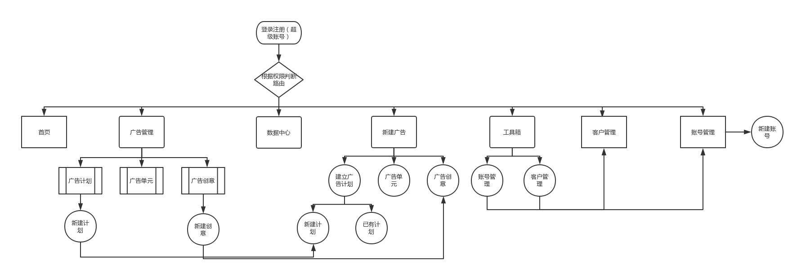

# bsp-project
### 整体技术选型
1. 脚手架  vue init webpack bsp-project
  i. 具有eslint配置，规范化代码格式
  ii. 有 vue-router+webpack 的相关配置，方便快捷
2. 框架 vue
  i. Vue在渲染过程中，会跟踪每一个组件的依赖关系，不需要重新渲染整个组件树。而React每当应用的状态被改变时，全部子组件都会重新渲染。
  ii. vue的路由搭建更加简易
3. 使用es6语法，scss作为css的扩展语言
es6的组件化
4. 使用element-ui做页面的排版
  i. 团队强大，机构清晰，功能强大
  ii. api有很丰富的demo
### 路由搭建
1. 使用第三方vue-router进行路由搭建
2. 使用路由的beforeEach属性做路由拦截，判断是否登录
### 数据请求
1. 请求使用了第三方包axios
2. 使用axios.interceptors.request做请求拦截，添加请求头传递token字段
3. 使用axios.interceptors.response做响应拦截，判断返回的状态以及返回需要的数据
### 项目中的核心功能
1. 广告的使用量，曝光量的显示。
在首页中，以折线图的形式显示。使用了echarts第三方的库。获取时间范围后处理数据为数组，发送请求获取数据然后渲染
2. 新建广告
tab切换，数据的上传
3. 注册用户
### 使用vuex做状态管理
1. state定义默认数据
2. mutations做数据的修改
3. actions做数据的异步请求
### 遇到的困难
> 新建创意时的数据存储与渲染
我的创意列表是存储在store中，这里获取我用到了mapState这个方法。
新建创意本身是一个tab切换，每一个创意的内容不一样，tab切换时更改，且文本框的内容是双向绑定。
解决：在computed获取当前显示的一个对象，解构赋值给当前组件自身的state, 在watch中在进行一次同样的操作

